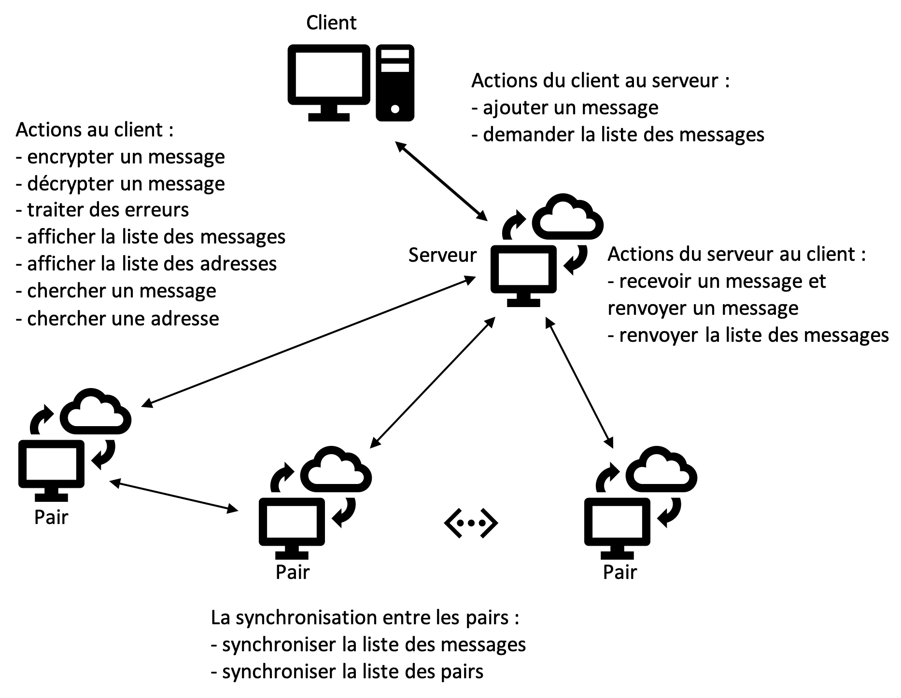

# CONTENT
1. [Introduction](#1-introduction)  
     1.1 [Objective](#objective)  
     1.2 [Frameworks](#frameworks-et-techniques)  
     1.3 [Définitions](#termes)  
2. [Représentation architecturalle](#2-représentation-architecturalle) 
3. [Représentation graphique](#3-représentation-graphique)  
     3.1 [Initialiser les adresses](#initialiser-les-adresses)  
     3.2 [Encrypter un message](#encrypter-un-message)  
     3.3 [Décrypter un message](#décrypter-un-message)  
	 3.4 [Traiter des erreurs](#traiter-des-erreurs)  
     3.5 [Afficher tous les messages](#afficher-tous-les-messages)  
     3.6 [Afficher toutes les adresses](#afficher-toutes-les-adresses)    
     3.7 [Renvoyer la liste des messages](#renvoyer-la-liste-des-messages)  
     3.8 [Recevoir un message](#recevoir-un-message)  
     3.9 [Sychroniser avec les autres pairs](#sychroniser-avec-les-autres-pairs)  
4. [Liste des méthodes](#4-liste-des-méthodes) 
5. [Execution](#5-execution) 

## 1. Introduction
Ce projet est un travail de session du groupe F qui est composé par les membres suivants:  
- Cyrille Franklin Deh Tagne
- Guillaume Carrier Couture
- Housseinatou Bah
- Jinsheng Gu
- Konan Kouame Wilfried Patrick
- Mohamed Bouh
- Pape Doudou Gassama. 

Ce projet est une application web monopage (Single Page Application, SPA) qui permet à l'utilisateur de mettre à jour le contenu de la page sans charger les autres pages.  

### Objective
Le but de ce projet est de créer un petit serveur dans un réseau distribué. Ce serveur peut communiquer avec le client ainsi que les pairs dans le réseau.   

### Frameworks et techniques
On choisi le framework Node.js avec la librairie Express.js à créer le serveur. Pour réaliser les fonctionalité à côté du client, on utilise les technologies et techniques suivantes:  
- HTML5 : créer la page Html pour héberger tous les composants et les actions du client.
- CSS3 : rendre des styles à la page Html.
- JavaScript : réaliser toutes les actions du client.  
- Ajax : envoyer les requêtes du client vers le serveur et recevoir les réponses du serveur.

### Termes
- **client** : l'ordinateur local, présivement c'est le navigateur web comme Chrome, Safari, Firefox ou Edge qui envoie les requêtes vers le serveur et reçoit les réponses du serveur.
- **serveur** : un ordinateur ou une image d'un ordinateur qui peut communiquer avec le client ou avec les autres serveurs.
- **pair** : un serveur dans le réseau distribué, c'est-à-dire, si on utilise l'ordinateur local comme le serveur web, cet ordinateur est aussi un pair dans le réseau distribué qui permet aux utilisateurs de communiquer de la façon pair-à-pair.
- **synchronisation** : les communications entre les pairs qui permettent les paire de mettre à jour les listes de messages et les listes de pairs.

## 2. Représentation architecturalle

	├── index.js           --- code js du serveur
	├── package.json       --- fichier de dépendances
	├── messages.json      --- fichier de messages
	├── functionalities.md --- fichier de la description des fonctionalités
	├── architecture.md    --- fichier de la description de l'architecture
	├── public             --- répertoire avec ressources statiques
	│   ├── css
	│   │   └── client.css    -- code de styles
	│   ├── js
	│   │   ├── client.js       -- code js du client
	│   │   └── forge.min.js    -- fichier copié de 'node-forge'
	│   └── img                 -- répertoire avec toutes les images
	├── views              --- répertoire avec la page statique
	│   └── courriel.html       -- page html de l'application 
	└── README.md
     
## 3. Représentation graphique

### Initialiser les adresses
*Description*: On fixe la liste des adresses (les clés publiques) qui représentent les pairs puis la stocke dans `localstorage`.

### Encrypter un message
*Description*: On utilise la librairie forge d'générer un pair de clés (clé publique et clé privée) et stocker la clé privée dans `localstorage`, puis on encrypte le message avec la clé publique.

### Décrypter un message
*Description*: On utilise récupère la clé privée de `localstorage`, puis on décrypte le message avec cette clé.

### Traiter des erreurs: 
*Description*: 
- afficher un message d'erreur quand il y a une erreur pendant l'encryption
- afficher un message d'erreur quand il y a une erreur pendant la décryption
- afficher un message quand l'utilisateur essaie d'envoyer un message mais laisse tous les champs vides

### Afficher tous les messages
*Description*: Afficher tous les messages qui viennent du serveur et associer une action *Decrypt* à chaque message.

### Afficher toutes les adresses
*Description*: Afficher toutes les adresses qui viennent de `localstorage`.

### Renvoyer la liste des messages
*Description*: Le serveur renvoie la liste des messages vers le client.

### Recevoir un message
*Description*: Le serveur reçoit un message du client et le stocke dans un fichier json pour le garder.

### Sychroniser avec les autres pairs
*Description*: Durant chaque 30 seconds, le serveur synchonise avec les autres pairs pour mettre à jour la liste des messages et la liste des pairs.

## 4. Liste des méthodes

| méthodes au client |
| :-------------: |
- `getKeyPair();`      --- générer un pair de clés et stocker la clé privée dans localstorage
- `initMsgAddress();`     --- initialiser la liste des adresses et stocker la liste dans localstorage
- `add();`   --- récupérer l'adresse publique et le message de l'interface graphique du navigateur. Puis utiliser la clé publique d'encrypter le message. Si il n'y a pas d'erreur, envoyer le message encrypté vers le serveur puis afficher le message retourné par le serveur dans la page html
- `getLetters();` --- envoyer une requête vers le serveur utilisant la méthode `GET` via `Ajax` et afficher la liste des messages retournés par le serveur
- `addDecryptAction();`  --- associer l'action de décryption à chaque message, s'il y a une erreur, l'afficher
- `decrypt();`     --- décrypter un message encrypté, s'il y a une erreur, l'afficher
- `getPubKeys();`  --- récupérer la liste des adresses de `localstorage`
- `swithStateOfDivs(arr,str);` --- changer les statues des blocs `div`, premier paramètre est un array, deuxième paramètre est une chaine de caractères
- `searchMessages();` --- rechercher un ou plusieurs messages dans la liste des messages selon le mot clé
- `searchAddresses();` --- rechercher un ou plusieurs adresses dans la liste des adresses selon le mot clé
- `json2Html(str);`  --- convertir une chaine de caractères json vers une chaine de caractères html. Le seul paramètre est une chaine de caractères json.

| méthodes au serveur |
| :-------------: |
- `app.get("/", (req, res) => {});`  --- recevoir la requête de type `GET` du client et retourner la page courriel.html vers le client
- `app.post("/addLetter", (req, res) => {});` --- recevoir la requête de type `POST` du client, stoker le message dans un fichier json et retourner un message vers le client pour indiquer le message a été envoyé avec succès
- `app.get("/getLetters", (req, res) => {});`  --- recevoir la requête de type `GET` du client et retourner la liste des messages vers le client
- `setInterval(()=>get(url,(err,newPeers)=>{},30000);` --- sychroniser le serveur avec les autre pairs et mettre à jour la liste des pairs
- `setInterval(()=>get(url,(err,newMsgs)=>{},30000);` --- sychroniser le serveur avec les autre pairs et mettre à jour la liste des messages

## 5. Exécution
- télécharger le fichier zip du projet via [ce lien](https://github.com/jason-js-gu/uqo-tech-internet-projet2) ou utiliser les commandes de `GIT` de le télécharger
- dans `VS Code` ouvrir le projet et ouvrir un terminale, installer les librairies avec la commande `npm install`
- activer le serveur avec la commande `node index.js`
- cliquer sur le lien qui contient le mot clé `localhost`
